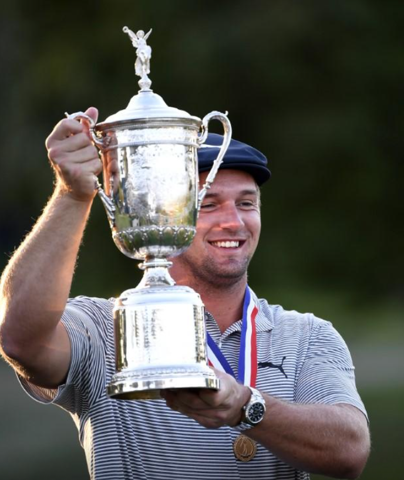

# DeChambeau muscles his way to U.S. Open victory

MAMARONECK, N.Y. (Reuters) - A bulked-up Bryson DeChambeau bashed his way to a six-shot U.S. Open victory on Sunday, silencing any lingering questions as to whether his brawny game could translate to the major stage.

World number nine DeChambeau, who began the day two shots back of U.S. Open debutant Matthew Wolff, clinched his first major title with a mix of jaw-dropping drives and clutch putts, shooting a virtually flawless three-under-par 67 to reach six under for the tournament.

“I did it. I did it. As difficult as this golf course was presented, I played it beautifully,” DeChambeau said of Winged Foot, on one of the hardest layouts the United States Golf Association has to offer.

Wolff (75), appearing in only his second major, was one shot back of DeChambeau at the turn but fell apart over a back nine that included two bogeys and a double-bogey.

A fearless DeChambeau, whose final round included an eagle, two birdies and a bogey, attacked at every chance and for his efforts was the only player to break par in the final round as he cruised to a maiden major at his 16th attempt.

The 27-year-old, who re-emerged from the PGA Tour’s three-month suspension in mid-June packing serious muscle and hitting a startling distance off the tee, attacked Winged Foot all week like few other golfers can.

So confident in his approach, DeChambeau unleashed his driver on practically every par-four and par-five hole as he figured the birdie chances would outweigh the risk that Winged Foot’s nasty rough creates.

“I hope that inspires people to say, hey, look, maybe there is a different way to do it,” said DeChambeau. “Not everybody has to do it my way. I’m not saying that. I’m just saying in general that there are different ways to do things.”

# ‘BATTLED HARD’

DeChambeau grabbed the solo lead after five holes, hit a perfectly-paced 40-foot eagle putt at the ninth to maintain a one-shot cushion in a tournament that came down to a two-horse race between him and Wolff as they made the turn.

Yet the 21-year-old Wolff, who was bidding to become the first player to win the U.S. Open on his tournament debut since Francis Ouimet in 1913, bogeyed the 10th and 14th holes before a double-bogey at 16.

“I battled hard. Things just didn’t go my way,” said Wolff. “But first U.S. Open, second place is something to be proud of and hold your head up high for.”

Former British Open champion Louis Oosthuizen (73) birdied the last to finish alone in third place, a distant eight shots back of DeChambeau and one shot clear of Harris English (73), who made a double-bogey at the first where he lost his tee shot.

Xander Schauffele (74) looked ready to make a back-nine charge after making the turn fresh off back-to-back birdies but the world number seven made five consecutive bogeys from the 13th and finished in fifth place.

Northern Irishman Rory McIlroy (75), who finished in a share of eighth place, was almost left in a state of disbelief at DeChambeau’s win given his inaccuracy off the tee at a tournament renowned for its thick rough.

“I don’t really know what to say because that’s just the complete opposite of what you think a U.S. Open champion does,” said McIlroy.

 

“Look, he’s found a way to do it. Whether that’s good or bad for the game, I don’t know, but it’s just - it’s not the way I saw this golf course being played or this tournament being played. It’s kind of hard to really wrap my head around it.”

